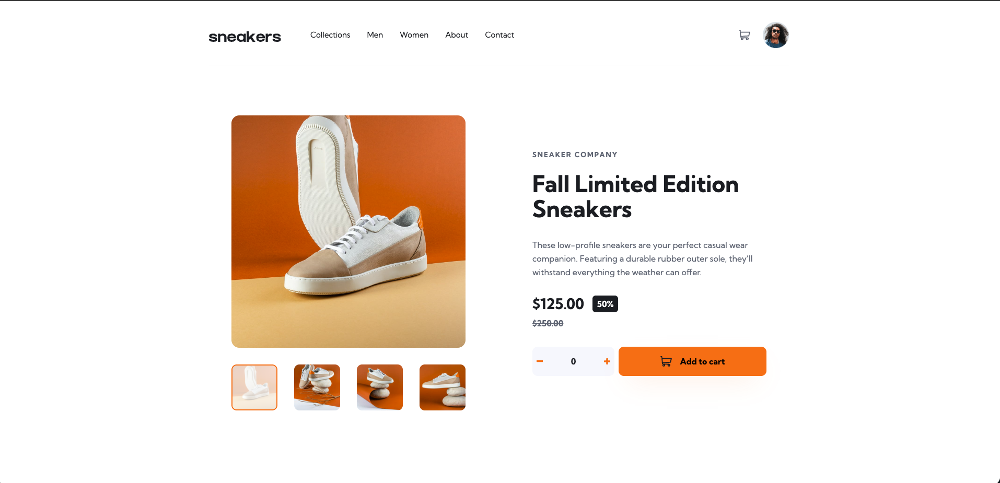

# Frontend Mentor - E-commerce product page solution

This is a solution to the [E-commerce product page challenge on Frontend Mentor](https://www.frontendmentor.io/challenges/ecommerce-product-page-UPsZ9MJp6). Frontend Mentor challenges help you improve your coding skills by building realistic projects.

## Table of contents

- [Overview](#overview)
  - [The challenge](#the-challenge)
  - [Screenshot](#screenshot)
  - [Links](#links)
- [My process](#my-process)
  - [Built with](#built-with)
  - [What I learned](#what-i-learned)
  - [Continued development](#continued-development)
  - [Useful resources](#useful-resources)
  - [AI Collaboration](#ai-collaboration)
- [Author](#author)

## Overview

### The challenge

Users should be able to:

- View the optimal layout for the site depending on their device's screen size
- See hover states for all interactive elements on the page
- Open a lightbox gallery by clicking on the large product image
- Switch the large product image by clicking on the small thumbnail images
- Add items to the cart
- View the cart and remove items from it

### Screenshot



### Links

- Solution URL: [Solution URL](https://github.com/hectorlil48/frontend-mentor-ecommerce-product-page)
- Live Site URL: [Live Site](https://hectorlil48.github.io/frontend-mentor-ecommerce-product-page/)

## My process

### Built with

- Semantic HTML5 markup
- CSS custom properties
- Flexbox
- Mobile-first workflow
- CSS Media Queries
- Vanilla JavaScript

### What I learned

This was my first project working heavily with JavaScript DOM manipulation. A few key things I picked up:

**Event bubbling and stopPropagation**
Learned that click events bubble up through parent elements, which caused my lightbox to open when clicking carousel buttons. Fixed it with:

```js
element.addEventListener("click", function (e) {
  e.stopPropagation();
});
```

**Hover media query for touch devices**
Learned that `:hover` styles stick on mobile after tapping. Wrapping hover styles in `@media (hover: hover)` prevents this:

```css
@media (hover: hover) {
  .button:hover {
    background-color: var(--orange-300);
  }
}
```

**Object-fit and object-position**
Used `object-fit: cover` with `object-position` to control how images crop inside fixed-height containers without distorting.

### Continued development

- **JavaScript** — I want to keep building projects that rely heavily on JS. I understand the DOM manipulation concepts used here but want to get more comfortable writing logic without having to think through it as much.
- **React and TypeScript** — My main focus going forward. I want to rebuild projects like this in React to understand what the framework is solving and get more comfortable with TypeScript.
- **CSS animations** — I used basic transitions in this project but want to get more comfortable with keyframe animations and more complex motion.
- **Accessibility** — I added aria-labels throughout but want to deepen my understanding of building truly accessible interfaces.

### Useful resources

- [MDN Web Docs](https://developer.mozilla.org) - My go-to reference for CSS properties and JavaScript methods throughout the project.
- [Claude (Anthropic)](https://claude.ai) - Used as a learning partner for talking through logic, debugging, and understanding concepts like event bubbling and the hover media query.
- [Google](https://google.com) - For finding specific solutions and Stack Overflow answers when debugging.

### AI Collaboration

- **Tool used:** Claude (Anthropic)
- **How I used it:** Used Claude as a learning partner throughout the project — talking through logic before writing code, debugging errors, understanding CSS concepts like event bubbling and object-fit, and getting feedback on semantic HTML decisions.
- **What worked well:** Having something to talk through problems with before writing code helped me understand what I was building rather than just copying solutions. Claude would ask me what I thought before giving answers which reinforced the learning.
- **What didn't work:** Sometimes suggestions didn't account for the specific structure of my HTML, so I still had to debug and adapt solutions myself.

## Author

- Website - [Hector Ramirez](https://www.hectorramirez.dev/)
- Frontend Mentor - [@hectorlil48](https://www.frontendmentor.io/profile/hectorlil48)
- LinkedIn - [@hector-ramirez-6a6509170](https://www.linkedin.com/in/hector-ramirez-6a6509170/)
